# Lab1 实验报告

Author: *刘佳隆*

Student ID: *518010910009*

Email: *liujl01@sjtu.edu.cn*

## 目录

- [Lab1 实验报告](#lab1-实验报告)
  - [目录](#目录)
  - [实验概述](#实验概述)
    - [SR 协议](#sr-协议)
    - [SR 协议存在的问题](#sr-协议存在的问题)
    - [SR 协议改进方法](#sr-协议改进方法)
  - [代码实现](#代码实现)
    - [数据包结构](#数据包结构)
    - [Sender](#sender)
      - [Global Variables](#global-variables)
      - [Sender\_FromUpperLayer](#sender_fromupperlayer)
      - [Sender\_FromLowerLayer](#sender_fromlowerlayer)
      - [Sender\_TimeOut](#sender_timeout)
    - [Receiver](#receiver)
      - [Global Variables](#global-variables-1)
      - [Receiver\_FromLowerLayer](#receiver_fromlowerlayer)
  - [实验结果](#实验结果)
    - [分项目测试](#分项目测试)
      - [Base](#base)
      - [Out of Order](#out-of-order)
      - [Loss](#loss)
      - [Corruption](#corruption)
    - [综合测试](#综合测试)
      - [Loss = 0.15, Corruption = 0.15, Out of Order = 0.15](#loss--015-corruption--015-out-of-order--015)
      - [Loss = 0.3, Corruption = 0.3, Out of Order = 0.3](#loss--03-corruption--03-out-of-order--03)
      - [Loss = 0.5, Corruption = 0.5, Out of Order = 0.5](#loss--05-corruption--05-out-of-order--05)
    - [压力测试](#压力测试)
      - [Loss = 0.9, Corruption = 0.9, Out of Order = 0.9](#loss--09-corruption--09-out-of-order--09)
    - [对比](#对比)
      - [Loss = 0.15, Corruption = 0.15, Out of Order = 0.15](#loss--015-corruption--015-out-of-order--015-1)
      - [Loss = 0.3, Corruption = 0.3, Out of Order = 0.3](#loss--03-corruption--03-out-of-order--03-1)
      - [Loss = 0.5, Corruption = 0.5, Out of Order = 0.5](#loss--05-corruption--05-out-of-order--05-1)
      - [Loss = 0.9, Corruption = 0.9, Out of Order = 0.9](#loss--09-corruption--09-out-of-order--09-1)

## 实验概述

本次实验要求实现一个简单的可信赖数据传输协议，能够处理数据传输过程中的乱序、丢失、错误问题。在实验文档中，给出了 GBN、SR、TCP 三种参考的传输协议。经过了解，我最终在 SR 协议上进行了优化，并作为我的实现方式。

关于 GBN 和 TCP 协议，由于我并未采用，在此不再介绍。以下将主要介绍 SR 协议的实现方式，以及我在此基础上的改进。

### SR 协议

SR - Selective Repeat 协议是一种滑动窗口协议。在 GBN 协议中，单个数据包在传输过程中的丢失和错误会引起 GBN 重传整个窗口中的所有数据包，进而造成效率的低下。而 SR 协议则进行选择性回传，只要收到了正确的数据包，即使其序列号之前的数据包丢失，也会进行缓存和回复当前收到数据包的 ACK，这样在发送端重传时只需要重传丢失的数据包，而不需要重传整个窗口。

### SR 协议存在的问题

在 SR 协议中，当一个数据包丢失时，若窗口滑动到该数据包为最小序号 -- 此时窗口中最后一个数据包发出，即使窗口中其余数据包均已发送成功，也会阻止窗口的滑动，造成不必要的等待。

例如下图中，数据包 0、1、3、4、5、6 均已收到 ACK，但是因为 2 丢失，窗口无法滑动。需要等待 2 的时钟超时并重新发送，直至收到 ACK 时窗口才会继续滑动。在等待 2 重传并收到 ACK 的时间中，整个系统处于静止，并未进行数据传输。

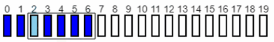

### SR 协议改进方法

第一种方法是为每个数据包设置一个单独的时钟，这样可以减少等待的时间。但当传输所需时间小于时钟超时时间时，仍会有系统静止的现象。

在本次实验中，由于我们只有一个物理时钟，方法一也并不适用。我的改进方法是当 Sender 收到数据包的 ACK 时，从 Buffer 中删除该数据包，并让未进入滑动窗口的数据包进入窗口。这样即使出现上图所示情况，系统也会继续发送 7、8、9 等数据包，直至整个窗口中全部为需要重新发送的数据包时，才会出现系统超时，并触发窗口重传。进而降低系统的静止时间，提升效率。

经过测试，改进后的协议需要传送数据包的数量与 SR 实现相同，但是时间性能更好，且随着故障率提高，时间性能提升会更明显。在压力测试中，改进后的协议性能提升了 2.98 倍。

## 代码实现

### 数据包结构

```C++
/**
 * 数据包的结构：
 * |<-  1 byte  ->|<-   4 bytes   ->|<-  4 bytes ->|<-  the rest  ->|
 * | payload size | sequence number |   checksum   |<-  payload   ->|
 *
 * payplad size: 表示 payload 的大小
 * sequence number: 表示数据包的序列号
 * checksum: 表示数据包的校验和
 */
```

### Sender

#### Global Variables

```C++
// ------------------------- 常量定义 -------------------------
#define WINDOW_SIZE 10       // 窗口大小
#define MAX_PAYLOAD_SIZE 119 // 最大 payload 大小 (128 - 1 - 4 - 4)
#define TIME_OUT_VALUE 0.3   // 定时器

// ------------------------- 全局变量 -------------------------
std::vector<packet> packet_buffer; // 数据包缓冲区
int sequence_number = 0;           // 数据包的序列号
std::mutex send_mutex;             // 互斥锁
int packet_in_window = 0;          // 窗口内的数据包数量

// ------------------------- 函数声明 -------------------------
std::hash<std::string> hash_fn; // hash 函数
```

#### Sender_FromUpperLayer

当收到来自上层的数据包时，Sender 会将数据包分割成多个 payload size 不超过 `MAX_PAYLOAD_SIZE` 的数据包，并计算校验和。然后将数据包发送到下层，并将数据包保存在 Buffer 中。

- `send_mutex` 用于保护 Buffer 的读写操作
- `sequence_number` 用于标记数据包的序列号，其初始为 0，每当向 buffer 中添加一个数据包时，`sequence_number` 会自增
- `packet_in_window` 用于记录当前窗口中的数据包数量，当接收到数据包时，若窗口未满，则将数据包发送到下层，并将其保存在 Buffer 中，同时 `packet_in_window` 自增，否则将数据包保存在 Buffer 中，等待窗口滑动时发送
- 校验和的计算方式为将 `payload_size`、`sequence_number` 和 `payload` 拼接成字符串，然后计算其哈希值，哈希函数使用 `hash_fn`

```C++
void Sender_FromUpperLayer(struct message *msg)
{
    send_mutex.lock();

    /* the cursor always points to the first unsent byte in the message */
    int cursor = 0;

    while (msg->size - cursor > 0)
    {
        /* calculate payload size*/
        int payload_size = std::min(MAX_PAYLOAD_SIZE, msg->size - cursor);
        /* calculate checksum */
        std::string payload(msg->data + cursor, payload_size);
        int checksum = hash_fn(std::to_string(payload_size) + std::to_string(sequence_number) 
                       + payload);
        /* fill in the packet */
        packet pkt;
        pkt.data[0] = payload_size;
        memcpy(pkt.data + 1, &sequence_number, 4);
        memcpy(pkt.data + 5, &checksum, 4);
        memcpy(pkt.data + 9, msg->data + cursor, payload_size);

        /* send it out through the lower layer */
        if (packet_in_window < WINDOW_SIZE)
        {
            Sender_ToLowerLayer(&pkt);
            Sender_StartTimer(TIME_OUT_VALUE);
            packet_in_window++;
        }

        /* save the packet in the buffer */
        packet_buffer.push_back(pkt);

        /* move the cursor */
        cursor += payload_size;

        /* update the sequence number */
        sequence_number++;
    }

    send_mutex.unlock();
}
```

#### Sender_FromLowerLayer

当收到来自下层的 ACK 时，Sender 会根据 ACK 的序列号，从 Buffer 中删除对应的数据包。删除后如果 Buffer 中数据包的个数不小于 `WINDOW_SIZE`，则将窗口中最后一个数据包发送到下层并启动定时器。否则将 `packet_in_window` 自减。

结合 `Sender_FromUpperLayer` 可以保证，窗口中的数据包一定满足如下条件：

- 至少发送过一次
- 未收到 ACK

因此并不会出现漏发的情况。

```C++
void Sender_FromLowerLayer(struct packet *pkt)
{
    send_mutex.lock();

    /* get ack number */
    int ack_number = *(int *)(pkt->data + 1);

    /* update the packet buffer */
    for (auto it = packet_buffer.begin(); 
         it != packet_buffer.end() && it != packet_buffer.begin() + WINDOW_SIZE; 
         it++)
    {
        int sequence_number = *(int *)(it->data + 1);
        if (sequence_number == ack_number)
        {
            /* remove the packet from the buffer */
            it = packet_buffer.erase(it);

            /* if there are packets in the buffer that can be sent */
            if (packet_buffer.size() >= WINDOW_SIZE)
            {
                /* send the packet */
                Sender_ToLowerLayer(&packet_buffer[9]);
                Sender_StartTimer(TIME_OUT_VALUE);
            }
            else
            {
                packet_in_window--;
            }

            break;
        }
    }

    send_mutex.unlock();
}
```

#### Sender_TimeOut

当定时器超时时，窗口中的数据一定满足如下条件：

- 至少发送过一次
- 在时钟超时后未收到 ACK

此时 Sender 会将窗口中的数据包全部重传，并重启定时器。

结合 `Sender_FromUpperLayer` 和 `Sender_FromLowerLayer` 可以保证，窗口中的数据包全是需要重传的数据包，进而避免了概述中提到的系统静止的情况 —— 窗口中部份数据等待系统超时重传，部分数据已经收到 ACK。

```C++
void Sender_Timeout()
{
    send_mutex.lock();

    /* resend all packets in the window */
    for (int i = 0; i < packet_in_window; i++)
    {
        Sender_ToLowerLayer(&packet_buffer[i]);
        Sender_StartTimer(TIME_OUT_VALUE);
    }

    send_mutex.unlock();
}
```

### Receiver

#### Global Variables

```C++
// ------------------------- 全局变量 -------------------------
std::vector<packet> receiver_packet_buffer; // 数据包缓冲区
int expected_sequence_number = 0;           // 期望的数据包序列号
std::mutex receive_mutex;                   // 互斥锁

// ------------------------- 函数声明 -------------------------
std::hash<std::string> receiver_hash_fn; // hash 函数
```

#### Receiver_FromLowerLayer

当收到来自下层的数据包时，Receiver 会首先计算校验和，然后根据校验和和序列号判断数据包是否正确。

若正确则将数据包发送到上层，发送 ACK 到下层，并将期望序列号 `expected_sequence_number` 自增。而后遍历 Buffer 中的数据包：

- 将序列号小于期望的序列号的数据包丢弃
- 将序列号等于期望的序列号的数据包发送到上层，从 Buffer 中删除该数据包，并将期望序列号 `expected_sequence_number` 自增，而后重新遍历 Buffer

若序列号小于期望的序列号，说明之前的 ACK 在传输过程中被篡改，让 Sender 误以为未收到正确的数据，直接丢弃即可。

若序列号大于期望的序列号，则将数据包保存在 Buffer 中。

若校验和不正确，则直接忽略，也不需要向 Sender 发送信息被篡改的 ACK。这样做的考虑是即使发送了被篡改信息的 ACK，ACK 在传输过程中也可能被篡改，不如当作数据包丢失处理，等待 Sender 的时钟超时后重传，降低了系统的复杂度。在 Sender 端对滑动窗口的优化保证了这样做并不会对系统效率造成太大的影响。

```C++
void Receiver_FromLowerLayer(struct packet *pkt)
{
    /* get payload size, sequence number, and checksum */
    int payload_size = pkt->data[0];
    int sequence_number = *(int *)(pkt->data + 1);
    int checksum_got = *(int *)(pkt->data + 5);

    /* if payload size is smaller than 0 or larger than 119, ignore it */
    if (payload_size <= 0 || payload_size > 119)
    {
        return;
    }

    /* calculate the checksum */
    std::string payload = std::string(pkt->data + 9, payload_size);
    int checksum_cal = receiver_hash_fn(std::to_string(payload_size) + 
                       std::to_string(sequence_number) + payload);

    /* if the checksum is correct and the sequence number is expected */
    if (checksum_got == checksum_cal)
    {
        receive_mutex.lock();

        /* send ack to the sender */
        struct packet ack_pkt;
        ack_pkt.data[0] = 0;
        memcpy(ack_pkt.data + 1, &sequence_number, 4);
        Receiver_ToLowerLayer(&ack_pkt);

        /* if sequence number is smaller than expected, ignore it */
        if (sequence_number < expected_sequence_number)
        {
            receive_mutex.unlock();
            return;
        }

        if (sequence_number == expected_sequence_number)
        {
            /* construct a message */
            struct message *msg = (struct message *)malloc(sizeof(struct message));
            ASSERT(msg != NULL);

            /* update the expected sequence number */
            expected_sequence_number++;

            /* copy the payload to the message */
            msg->size = payload_size;
            msg->data = (char *)malloc(msg->size);
            ASSERT(msg->data != NULL);
            memcpy(msg->data, pkt->data + 9, msg->size);

            /* deliver the message to the upper layer */
            Receiver_ToUpperLayer(msg);

            /* check if there are any packets in the buffer that can be delivered */
            for (auto it = receiver_packet_buffer.begin(); it < receiver_packet_buffer.end();)
            {
                /* get sequence number */
                int sequence_number = *(int *)(it->data + 1);

                /* if the sequence number is smaller than expected, delete it */
                if (sequence_number < expected_sequence_number)
                {
                    it = receiver_packet_buffer.erase(it);
                    continue;
                }

                /* if the sequence number is expected */
                if (sequence_number == expected_sequence_number)
                {
                    /* update the expected sequence number */
                    expected_sequence_number++;

                    /* copy the payload to the message */
                    msg->size = it->data[0];
                    free(msg->data);
                    msg->data = (char *)malloc(msg->size);
                    ASSERT(msg->data != NULL);
                    memcpy(msg->data, it->data + 9, msg->size);

                    /* deliver the message to the upper layer */
                    Receiver_ToUpperLayer(msg);

                    /* remove the packet from the buffer */
                    receiver_packet_buffer.erase(it);

                    /* set the iterator to the beginning */
                    it = receiver_packet_buffer.begin();
                }
                else
                {
                    it++;
                }
            }

            /* don't forget to free the space */
            if (msg->data != NULL)
                free(msg->data);
            if (msg != NULL)
                free(msg);
        }
        else
        {
            /* save the packet in the buffer */
            receiver_packet_buffer.push_back(*pkt);
        }

        receive_mutex.unlock();
    }
}
```

## 实验结果

### 分项目测试

#### Base

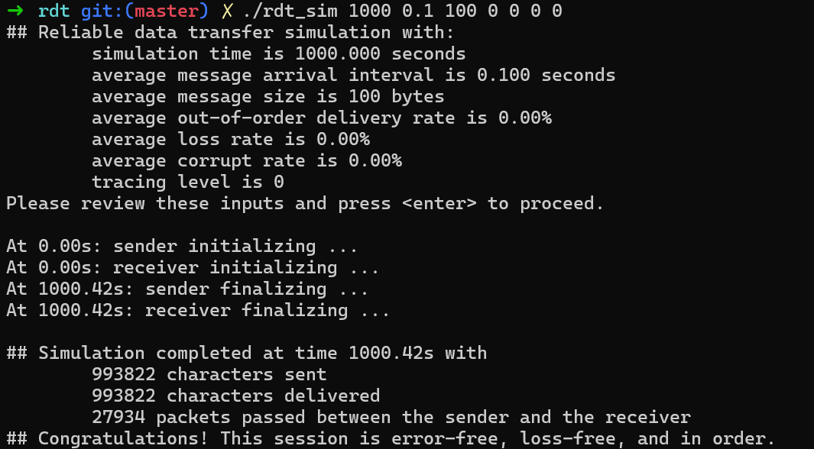

#### Out of Order

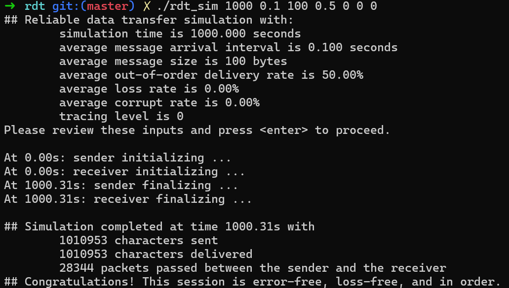

#### Loss


#### Corruption

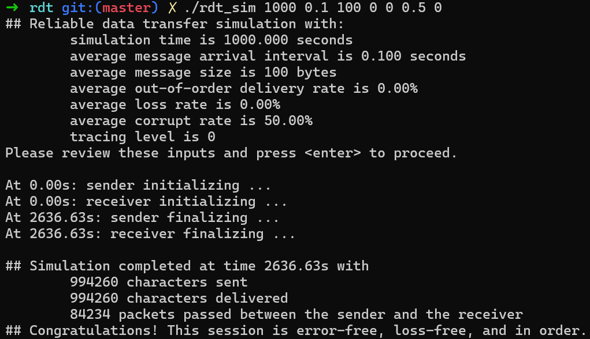

### 综合测试

#### Loss = 0.15, Corruption = 0.15, Out of Order = 0.15

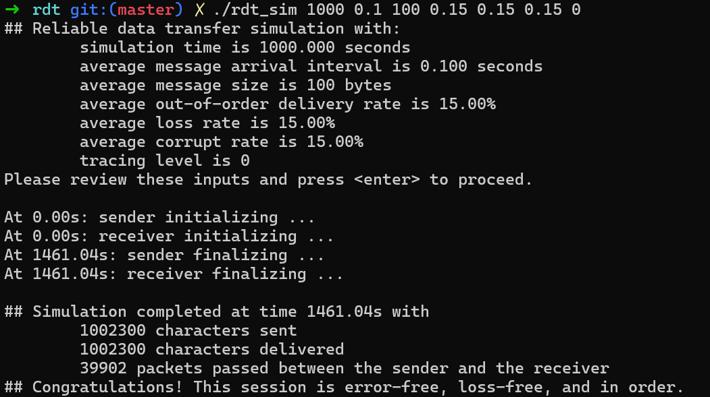

#### Loss = 0.3, Corruption = 0.3, Out of Order = 0.3

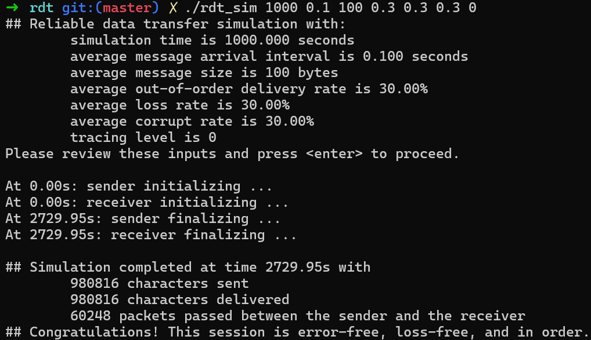

#### Loss = 0.5, Corruption = 0.5, Out of Order = 0.5

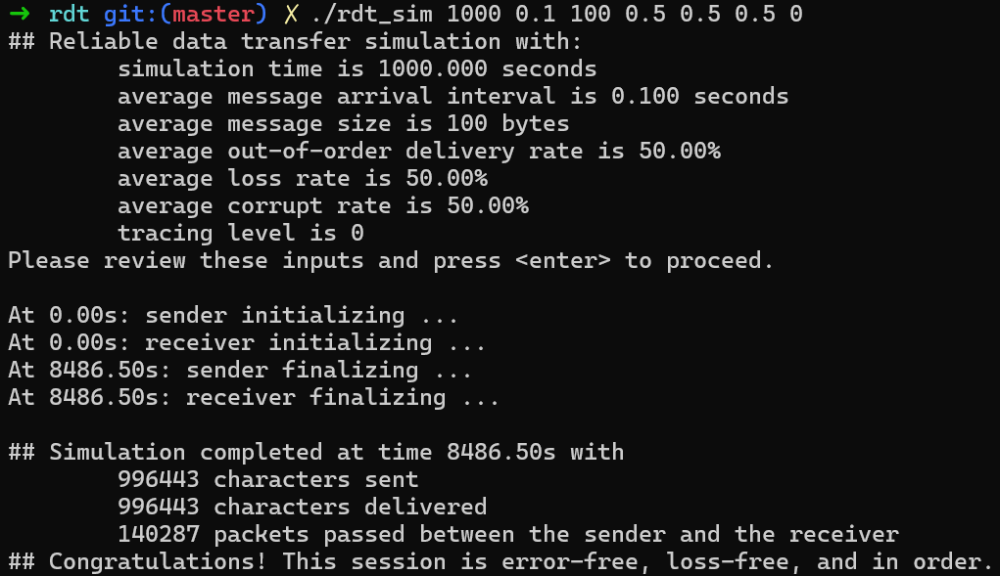

### 压力测试

#### Loss = 0.9, Corruption = 0.9, Out of Order = 0.9

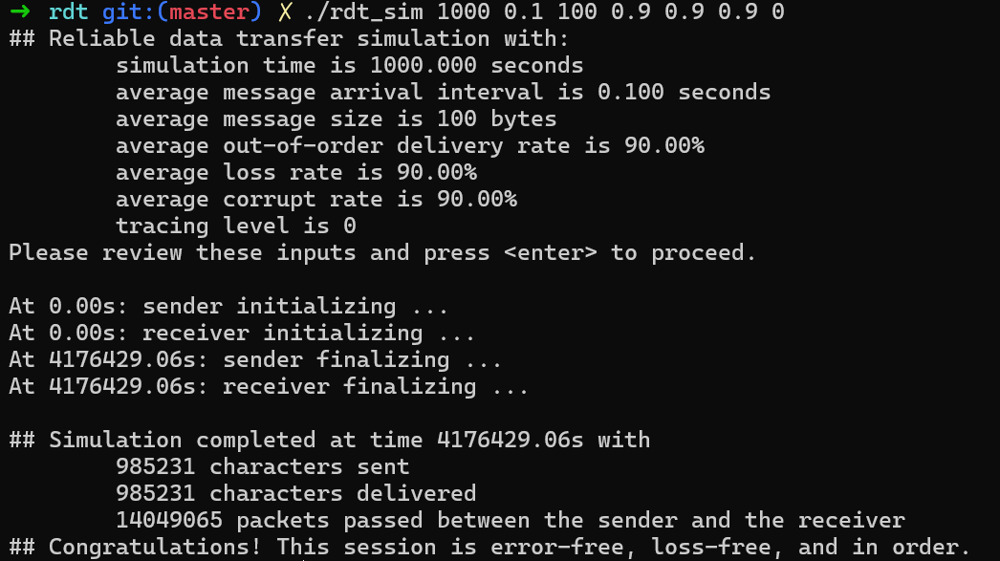

### 对比

对比 SR 实现，改进后的协议需要传送数据包的数量与 SR 实现相同，但是时间性能更好，且故障率越高，性能提升越明显。

对比代码：https://github.com/Musicminion/2022-2023-1-Cloud-OS/tree/main/Lab1

#### Loss = 0.15, Corruption = 0.15, Out of Order = 0.15

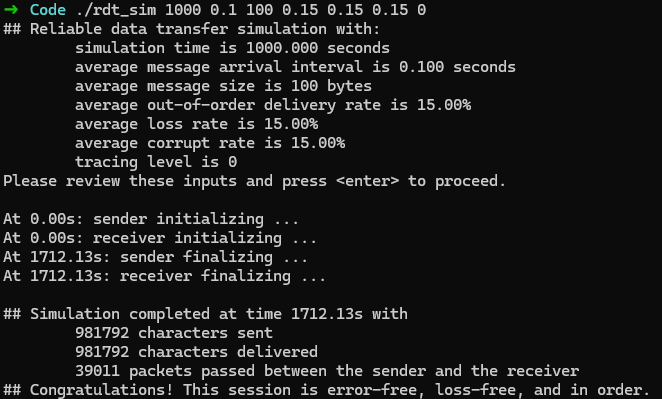

性能提升：`1712.13 / 1441.04 = 1.19`

#### Loss = 0.3, Corruption = 0.3, Out of Order = 0.3

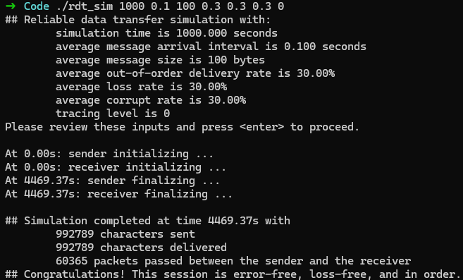

性能提升：`4469.37 / 2729.95 = 1.64`

#### Loss = 0.5, Corruption = 0.5, Out of Order = 0.5

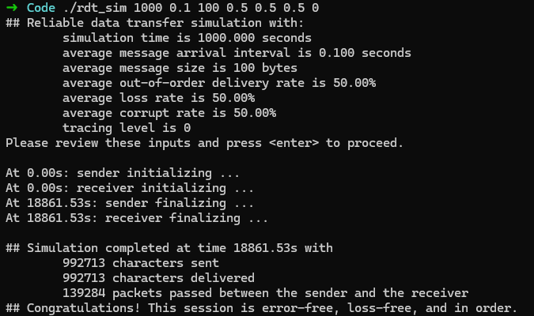

性能提升：`18861.53 / 8486.50 = 2.22`

#### Loss = 0.9, Corruption = 0.9, Out of Order = 0.9

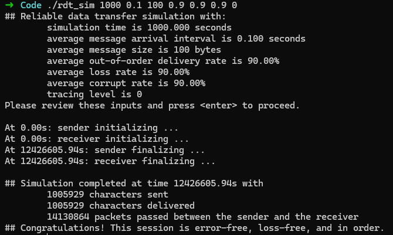

性能提升：`12426605.94 / 4176429.06 = 2.98`
