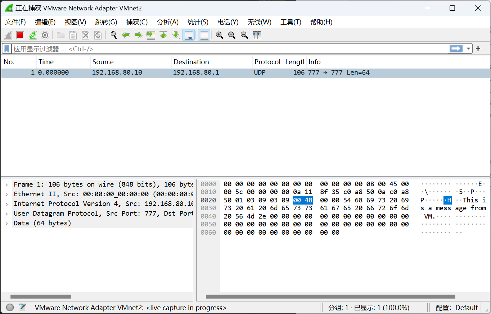
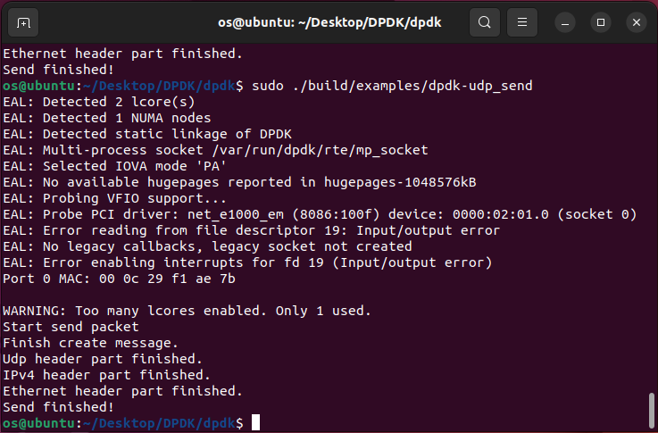

# Lab2 实验报告

Author: *刘佳隆*

Student ID: *518010910009*

Email: *<liujl01@sjtu.edu.cn>*

## Part 1

- Q1: What's the purpose of using hugepage?
  1. 通过更大的内存页可以减少相同空间大小所需的页表项，以减少 TLB（Translation Lookaside Buffer）Miss 的次数和 swap 的次数
  2. 也降低了将虚拟地址转化为物理地址所需的时间
  3. 减少查询页表项的层数
  
- Q2: Take examples/helloworld as an example, describe the execution flow of DPDK programs?
  1. 在`main`函数中，首先调用`rte_eal_init`函数初始化环境抽象层 EAL（Environment Abstraction Layer）。此处的 rte 是指 runtime environment。`rte_eal_init`会读取入口参数，解析并保存作为 DPDK 运行的系统信息，依赖这些信息，构建一个针对包处理设计的运行环境。而 EAL 会为 DPDK 提供应用程序加载和启动、核心绑定和分配、内存管理、中断处理等功能。
  2. `RTE_LCORE_FOREACH_WORKER`宏遍历每个工作逻辑核心（worker lcore），并对每个核心调用 `rte_eal_remote_launch`函数，将`lcore_hello`函数作为远程启动的目标函数。
     1. `lcore_hello`首先获取当前逻辑核心（lcore）的 ID，然后打印 *hello from core #*，显示是从哪个核心发送的消息。
     2. `rte_eal_remote_launch`第一个参数是从线程，是被征召的线程；第二个参数是传给从线程的参数；第三个参数是指定的逻辑核，从线程会执行在这个 core 上。
  3. 在主逻辑核心上调用`lcore_hello`函数。
  4. 调用`rte_eal_mp_wait_lcore`函数等待所有逻辑核心完成执行。
  5. 调用`rte_eal_cleanup`函数清理 EAL 资源。

- Q3: Read the codes of examples/skeleton, describe DPDK APIs related to sending and receiving packets.
  - 与发送和接收数据包相关的 DPDK API 调用主要位于 `lcore_main`函数中。
  - `rte_eth_tx_burst`函数用于将数据包发送到指定的端口。其参数分别为端口号、队列号、数据包数组和数据包数量。其返回值为实际发送的数据包数量。
  - `rte_eth_rx_burst`函数用于从指定的端口接收数据包。其参数分别为端口号、队列号、数据包数组和数据包数量。其返回值为实际接收的数据包数量。
  - `etr_pktmbuf_free`函数用于释放数据包的内存。

- Q4: Describe the data structure of 'rte_mbuf'.
  - `rte_mbuf`是 DPDK 中用于存储数据包的数据结构。由于数据成员较多，所以跨两个cache line大小，通过`RTE_MARKER cacheline0`和`RTE_MARKER cacheline1`来标示两个cache line，原则上将基础性、频繁访问的数据会放在`cacheline0`里面。其主要数据成员定义如下：

    ```c
    struct rte_mbuf {
        /* first cache line */
        // 当前 mbuf 的虚拟地址
        // 标准 buf addr 的指向的内存是在 mbuf 头部开始，偏移一个 mbuf 头和私有数据的大小。
        // 如下所示：m->buf_addr = (char *)m + sizeof(struct rte_mbuf) + priv_size。
        // 初始化这个变量是在我们创建 mbuf 的 mempool 的时候完成的。
        void *buf_addr; 
        // 当前 mbuf 的物理地址
        rte_iova_t buf_iova;
        // 标识 mbuf 的 data room 开始地址到报文起始位置的偏移
        // 默认是设置为 RTE_PKTMBUF_HEADROOM（128）
        // 在创建一个 mbuf 的 mem pool 的时候，会指定 data room 的大小。
        uint16_t data_off;
        // 引用计数，用于多个 mbuf 共享一个数据 buffer，表示 mbuf 被引用的次数。
        // 在 mbuf 被释放的时候，需要检查，确定引用计数只能为1，否则报错。
        uint16_t refcnt; 
        // Number of segments。当前 mbuf 的链表长度，表示其有多少个分段。
        uint16_t nb_segs; 
        // 当前 mbuf 的端口号
        uint16_t port; 
        // offload flags，用于标识 mbuf 的一些特性，如是否需要校验和、是否需要 offload 等。
        uint64_t ol_flags; 

        uint32_t packet_type; // 用于标识当前 mbuf 的包类型，如 L2、L3、L4 和 tunnel 等。
        uint32_t pkt_len; // 总的报文大小的长度，包含所有 seg 分段报文的报文长度
        uint16_t data_len; // 当前 mbuf 的数据长度，不包含其他 seg 分段报文的数据长度。
        uint16_t vlan_tci; // VLAN tag control information，当前 mbuf 的 vlan tag 信息。
        uint32_t rss; // RSS hash result，当前 mbuf 的 RSS hash 结果。
        uint16_t vlan_tci_outer; // outer VLAN tag control information
        uint16_t buf_len; // 当前 mbuf 的 buffer 的长度，包含 head 的长度和 data 的长度。
        struct rte_mempool *pool; // mbuf pool，表示当前 mbuf 的 mempool。

        /* second cache line */
        struct rte_mbuf *next; // 下一个 mbuf，用于标识当前 mbuf 的下一个 mbuf。
        uint64_t tx_offload;  // TX offload，用于标识当前 mbuf 的 TX offload 信息。
        uint16_t priv_size; // private data size，表示当前 mbuf 的私有数据的大小。
        uint16_t timesync; // timesync，用于标识当前 mbuf 的时间同步信息。
    };
    ```

## Part 2

通过 wireshark 和 虚拟机中相应的信息提示，可以说明成功使用 DKDP 实现了对数据包的发送和接收。


