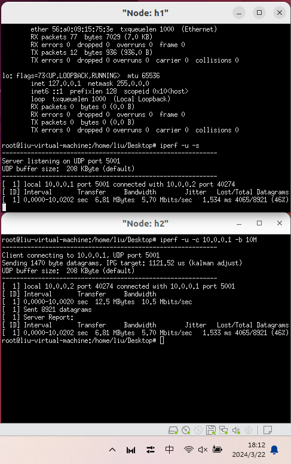
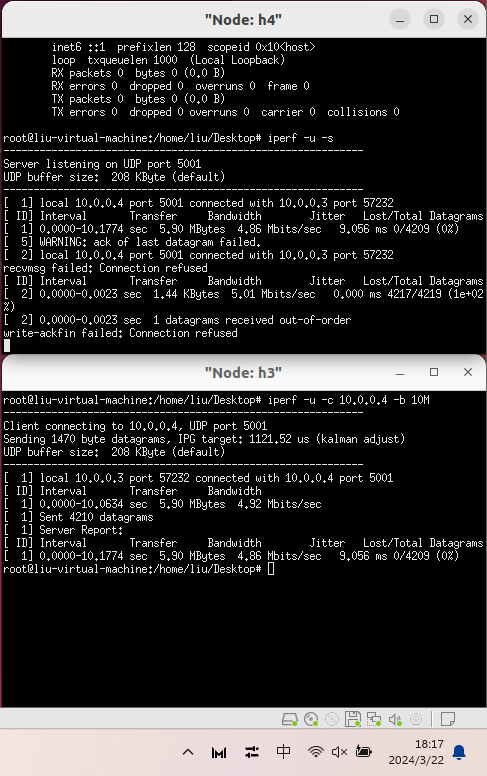

# Lab3 实验报告

Author: *刘佳隆*

Student ID: *518010910009*

Email: *<liujl01@sjtu.edu.cn>*

## Task 1


## Task 2


## Task 3

### 3.1



### 3.2



### 3.3


### Question 1

`$ ovs-ofctl add-flow s1 in_port=5,action=meter:1,output:6 -O openflow13`

这条指令的作用是向s1网桥添加一条流表规则。

- add-flow: 添加新流表条目。
- in_port=5: 规则匹配输入端口为5的数据包。
- action=meter:1: 对匹配的数据包应用计量器1进行速率限制处理。
- output:6: 如果数据包经过计量后未被丢弃，则将数据包输出到端口6。
- -O openflow13: 表示使用OpenFlow 1.3版本进行交互。

其中，计量器1由line11的指令创建，类型为“drop”，即当流量超过阈值时丢弃数据包，速率限制为5000kbps。

`$ ovs-ofctl dump-flows s1 -O openflow13`

这条命令的作用是从名为s1的OVS网桥中获取当前所有的OpenFlow流表项信息。

- dump-flows: 用于输出当前OVS网桥上的流表条目（即已配置好的匹配规则和对应动作）。
- s1: 是目标OVS网桥的名称。
- -O openflow13: 表示使用OpenFlow 1.3版本进行交互。

该命令与line2的命令相同，再次执行这条命令是为了查看在设置了流表规则之后，s1网桥上最新的流表状态，确认限速规则是否成功添加并生效。

### Question 2

| 限速方式 | 参数设置                       | 传输带宽      | 接收带宽     | 抖动    |
| -------- | ------------------------------ | ------------- | ------------ | ------- |
| 网卡限速 | ingress_policing_rate=5000kbps | 10.5Mbits/sec | 5.70Mbit/sec | 1.534ms |
| 队列限速 | max_rate=5000kbps              | 4.92Mbit/sec  | 4.86Mbit/sec | 9.056ms |
| 流表限速 | type=drop,rate=5000kbps        | 10.5Mbit/sec  | 5.34Mbit/sec | 0.858ms |

| 限速方式 | 丢包率 | 说明                                                                             |
| -------- | ------ | -------------------------------------------------------------------------------- |
| 网卡限速 | 46%    | 限制⽹卡上接收分组（ingress）的速率，当速率超过了配置速率，就简单的把数据包丢弃。 |
| 队列限速 | 0%     | 使⽤队列queue，可以缓存和调度数据包发送顺序                                       |
| 流表限速 | 49%    | 在交换机上设置流表规则，对匹配的数据包应用计量器进行速率限制处理。               |

从传输带宽来看，网卡限速和流表限速的传输带宽都达到了10.5Mbits/sec，而队列限速的传输带宽只有4.92Mbit/sec。其原因在于，队列限速会在尽量不中断连接的前提下来平滑⽹络流量。因此传输带宽会受到发送速率和接收速率的限制。而网卡限速和流表限速是对接收的数据包进行限速，因此传输带宽不受发送速率的限制。

从接收带宽来看，网卡限速和流表限速的接受带宽都略高于我们的设置目标5Mbit/sec，而队列限速的接受带宽为4.86Mbit/sec，在我们设定的范围之内。其原因在于网卡限速和流表限速都是通过丢弃超出速率的数据包来达到限速目的，所以实际接收到的数据量受限于设定的速率。但由于网络环境、控制算法、测量误差等因素的影响，实际接受带宽略高于设置的限速。

抖动是指数据包在网络中传输时，相对于理想情况下各数据包之间的时间间隔发生的变化。在本次测试中，流表限速的抖动最小，为0.858ms；网卡限速的抖动次之，为1.534ms；而队列限速的抖动最大，为9.056ms。一般情况下，队列限速的抖动应该相对较小，因为队列能够缓存和有序调度数据包，有助于平滑发送。但是本次出现反常现象的原因可能是数据包在队列中等待调度时，受网络负载不均衡、调度算法效率、以及网络设备本身的处理能力的影响，导致数据包接受的延时增大，从而导致抖动增加。此外，在此次测试中，流表限速方案实现了最低的抖动。其原因可能是流表限速利用OpenFlow的计量器机制对流量进行精细控制，能够在交换机层面实时调控数据包的发送速率，有效地减少了数据包到达时间间隔的波动，从而降低了抖动。

丢包率是指在网络传输过程中，由于网络拥塞、传输错误等原因导致数据包丢失的比例。在本次测试中，队列限速的丢包率为0%，这是因为队列提供了缓冲空间，即使在网络繁忙时也能暂时存储超出速率的数据包，从而避免了丢包现象的发生。网卡限速和流表限速的的丢包率分别为46%、49%。这是因为这两种限速方法在达到设定速率后直接丢弃超出的数据包，没有提供额外的缓冲或重传机制。

## Task 4


通过对h1进行队列限速，发现当三个Client同时传输数据且稳定后，他们的带宽都在3.3Mbits/sec左右，且丢包率为0。这说明服务器端的队列限流机制按照某种公平原则对客户端进行了带宽分配，保证了三个客户端之间的带宽大致均衡。

## Task 5

我选择使用了流表并结合每个端⼝队列来实现QoS框架。

首先使用以下命令为Server端创建三个队列，用于分别接收来自h2、h3和h4的数据包，并根据要求对数据包进行速率限制：

```bash
sudo ovs-vsctl set port s1-eth1 qos=@qos1 -- \
--id=@qos1 create qos type=linux-htb queues=2=@q2,3=@q3,4=@q4 -- \
--id=@q2 create queue other-config:min-rate=5000000 other-config:max-rate=5500000 -- \
--id=@q3 create queue other-config:min-rate=3000000 other-config:max-rate=3500000 -- \
--id=@q4 create queue other-config:min-rate=0 other-config:max-rate=1500000
```

然后使用以下命令为Server端创建流表规则，将来自h2、h3和h4的数据包分别发送到对应的队列：

```bash
sudo ovs-ofctl add-flow s1 in_port=2,action=set_queue:2,output:1 -O openflow13
sudo ovs-ofctl add-flow s1 in_port=3,action=set_queue:3,output:1 -O openflow13
sudo ovs-ofctl add-flow s1 in_port=4,action=set_queue:4,output:1 -O openflow13
```

最后在三个Client端同时发送数据包，观察Server端的带宽和丢包率情况。

```bash
iperf -u -c 10.0.0.1 -b 10M -t 20 -i 1
```

最终运行结果如下：


从结果可以看出，h2、h3和h4的带宽分别为5.26Mbits/sec、3.37Mbits/sec和1.45Mbits/sec，且丢包率均为0。总的接收带宽为10.08Mbits/sec。说明这种配置方法能够完成所给的既定任务，并较好的利用了带宽限制。
